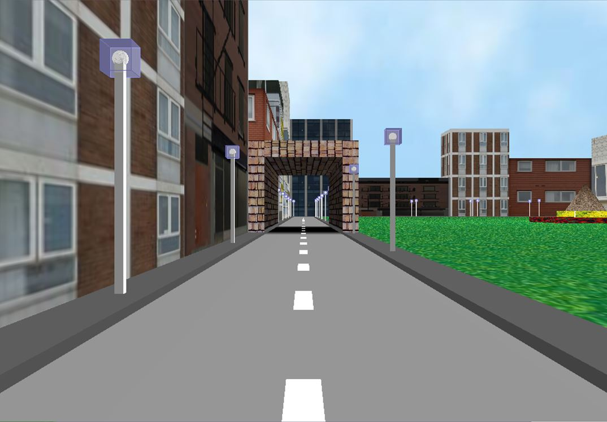
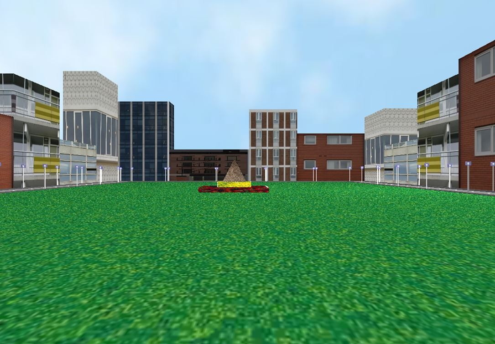
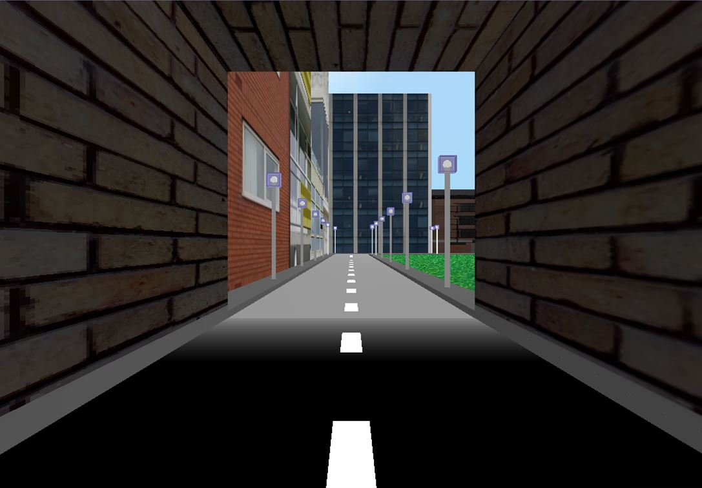
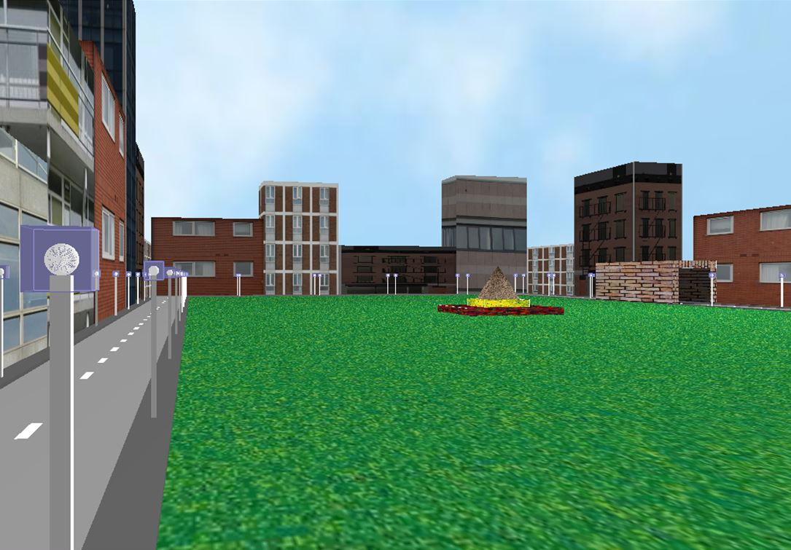

# Navigation in a city block
**_<ins>Overview</ins>_:** Computer Graphics project in Visual C++ using [OpenGL](https://www.opengl.org/)

*Please Note* - This is a project developed in 2009 that I found in my old (and now unused) laptop. It needs more work to run on latest versions of Visual Studio and OpenGL (see TODO list below).

### TODO:
* Update code to run with current [Visual Studio](https://visualstudio.microsoft.com/downloads/) and [OpenGL](https://www.opengl.org/)
* Setup images directory to recreate the graphics and generate the model

### Description:

The project simulates navigation in a city block in daytime. It has been developed using OpenGL on the visual C++ platform. The city block comprises of a rectangular looped road, with sidewalks bordering the roads. Lampposts are placed on either side of each road strip. At some distance from the beginning of the navigation origin, a tunnel has been placed on the road to give a shadow effect. A park is situated within the confines of the rectangular road. At the center of the park, a floral pattern with a central stone pyramid has been constructed. Buildings have been placed at the outside of every road. The daytime sky has been simulated by placing the whole structure in a sphere. All objects (buildings, park, tunnel, sky) have been given a realistic look by applying texturing.

### Concepts Implemented

- **Perspective viewing:**
    - Functions used-  *gluPerspective(), gluLookAt()*

    Perspective has been used to create the illusion of depth, for simulating real-world viewing. It simulates the viewing of a human eye by accurately differentiating between objects placed at different distances from the viewer. The viewer is simulated by gluLookAt() function.

- **3D Geometric rendering:**
    - Functions used-  *glBegin(GL_POLYGON), glEnd(), glutWireSphere(), glutSolidCube()*
    
    All objects in the project have been drawn in a 3D space using the above functions. 

- **Transformations (Rotation, Translation, Scaling):**
    - Functions used- *glTranslatef(), glScalef(), glRotatef()*
    
    The functions for translation and rotation have been used for camera navigation. The navigation has been confined along the plane of the roads. The viewer moves along the roads in a straight line and can also look left and right. Lampposts and sidewalks have been created by scaling a cube.

- **Input and interaction:**
    - Function used- *glutSpecialFunc()*
    
    The viewer can navigate along the roads using the keys:

    - Up arrow (&#8593;) - The viewer moves forward along the road
    - Down arrow (&#8595;) - The viewer moves backward along the road
    - Left arrow (&#8592;) - The viewer looks left
    - Right arrow (&#8594;) - The viewer looks right

- **Lighting:**
    - Functions used- *glEnable(GL_LIGHTING), glLightModelfv(GL_LIGHT_MODEL_AMBIENT,ambientLight1)  glLightfv(GL_LIGHT0,GL_AMBIENT,ambientLight), glLightfv(GL_LIGHT0,GL_DIFFUSE,diffuseLight), glEnable(GL_COLOR_MATERIAL), glColorMaterial(GL_FRONT,GL_AMBIENT_AND_DIFFUSE)*

    Lighting is used to simulate a day-time effect. Only diffuse and ambient components of light have been enabled. **GL_COLOR_MATERIAL** has been used to allow objects to retain their actual color.

- **Blending:**
    - Functions used- *glEnable(GL_BLEND), glMaterialf(), glBlendFunc()*
    
    Blending has been used on lampposts to give a glass effect. This allows the viewer to see the light bulb through the casing (cube) that encloses it.

- **Texturing:**
    - Functions used- *glGenTextures(), glBindTexture(),glTexImage2D(),glTexCoord2f(),glTexParameteri()*
    
    2D Texturing has been applied to objects to give a realistic look. Buildings, tunnel, park and the sky have all been texture mapped using 256 x 256 24-bit bitmap images. Images of .JPEG type were converted into .bmp by using MS Paint.

### Screenshots from last successful run

1. Starting point- a sqaure city block with buildings, a tunnel, sky, park and lampposts surrounding the road

2. Facing the park

3. View from inside the tunnel

4. A stone pyramid in the park

